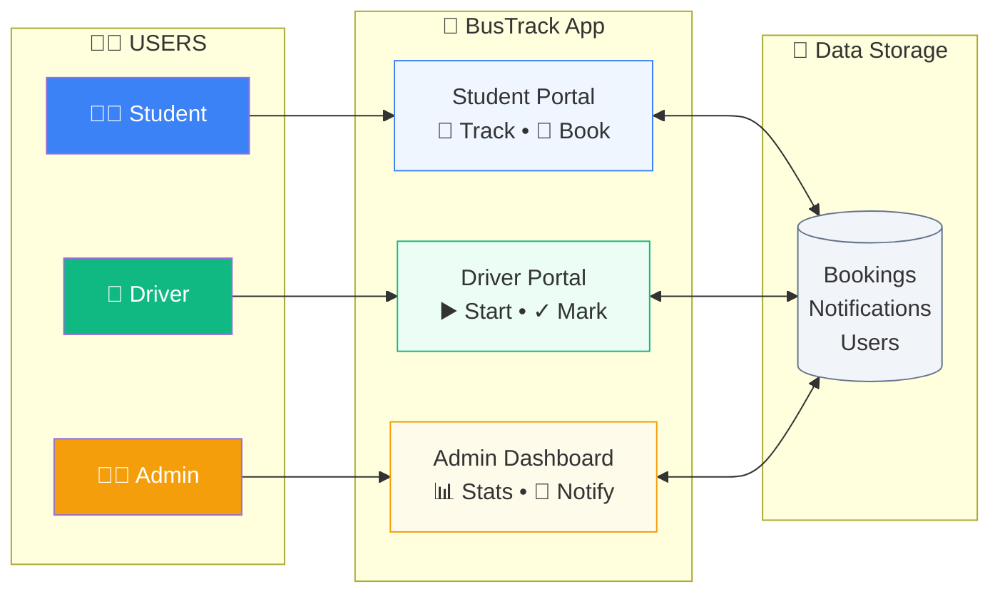
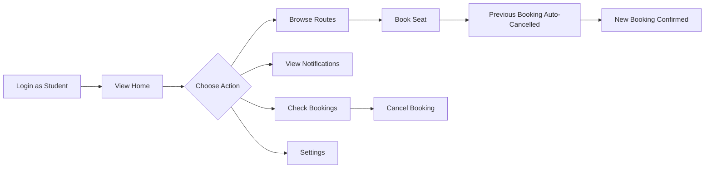
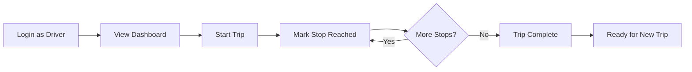
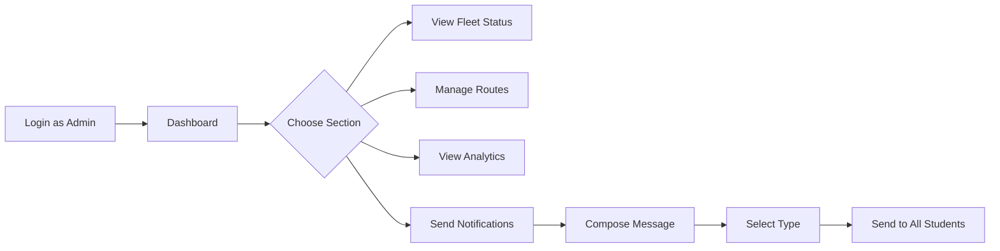
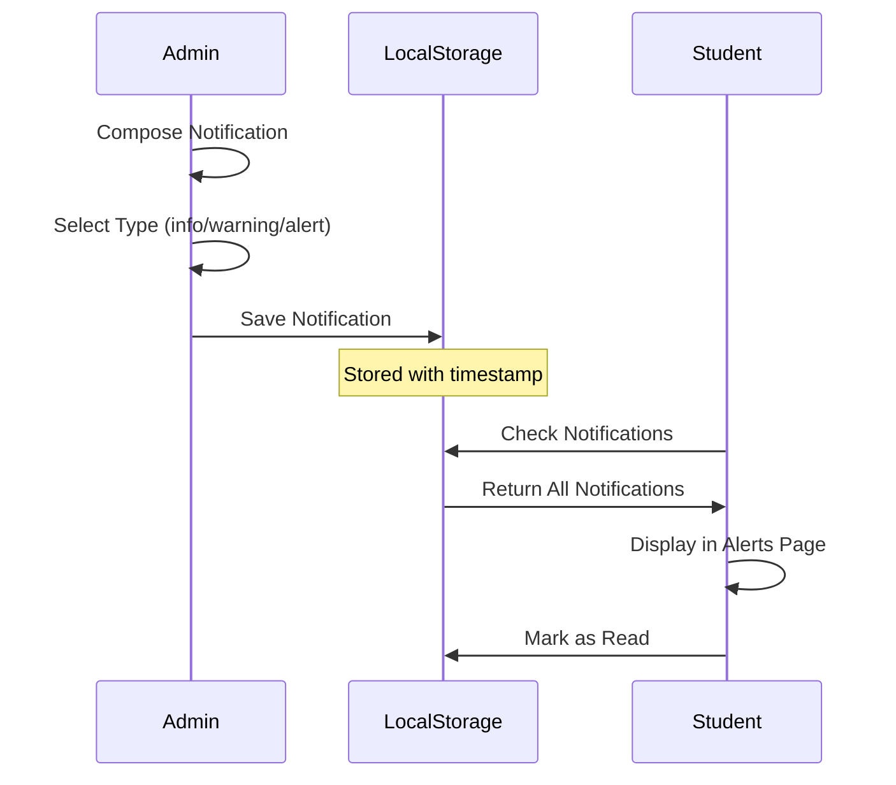
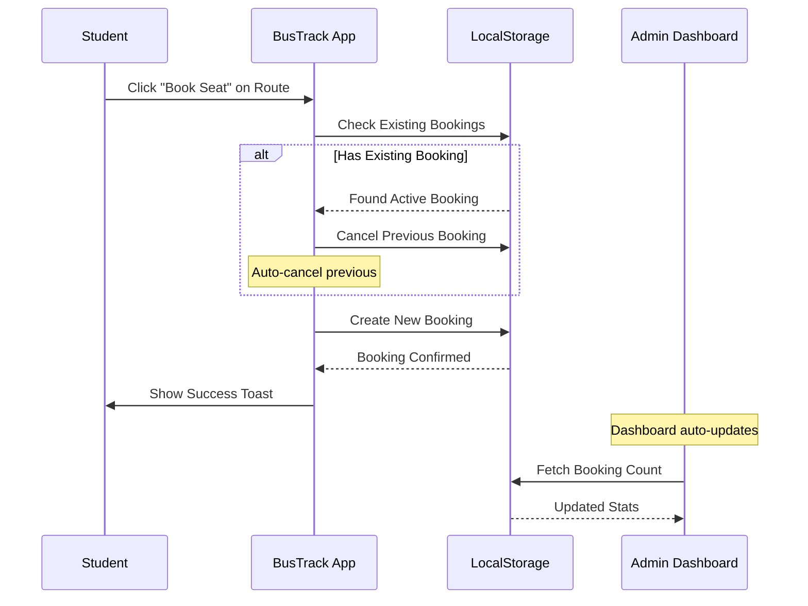

# BusTrack - Project Workflow Documentation

## 📋 Project Overview

**BusTrack** is a Single Page Application (SPA) for campus bus management with three user roles: **Student**, **Driver**, and **Admin**. The system enables real-time bus tracking, seat booking, and notification management.

---

## 🔄 System Architecture



---

## 👥 User Role Workflows

### 1️⃣ Student Workflow



**Student Features:**
| Feature | Description |
|---------|-------------|
| **View Routes** | Browse all available bus routes with schedules |
| **Book Seat** | Reserve a seat on any active route (one booking at a time) |
| **Auto-Cancel** | Previous booking automatically cancelled when booking new seat |
| **Notifications** | Receive alerts from Admin about delays, changes, etc. |
| **View Bookings** | See current active bookings and cancel if needed |

---

### 2️⃣ Driver Workflow



**Driver Features:**
| Feature | Description |
|---------|-------------|
| **Start Trip** | Begin route with single button click |
| **Mark Stops** | Update progress at each stop (7 stops total) |
| **Live Status** | Shows current stop and next destination |
| **Trip Completion** | Automatic status update when all stops visited |

---

### 3️⃣ Admin Workflow



**Admin Features:**
| Feature | Description |
|---------|-------------|
| **Dashboard Metrics** | Active buses, total passengers, bookings today |
| **Live Fleet** | Real-time bus locations and statuses |
| **Route Management** | View and manage all bus routes |
| **Analytics** | Charts showing passenger trends and route usage |
| **Notifications** | Send alerts to all students |

---

## 🔔 Notification Flow (Admin → Student)



---

## 🎫 Seat Booking Flow



---

## 📁 Project File Structure

```
bus-management/
├── index.html          # Main SPA entry point
├── app.js              # Core application logic
├── styles.css          # Global styles
├── student/            # Student portal assets
│   ├── index.html
│   ├── app.js
│   ├── styles.css
│   └── sw.js          # Service worker for offline
├── driver/             # Driver portal assets
│   ├── index.html
│   ├── app.js
│   └── styles.css
├── admin/              # Admin dashboard assets
│   ├── index.html
│   ├── app.js
│   └── styles.css
└── landing/            # Landing page assets
```

---

## 💾 Data Storage Structure

### Bookings (`localStorage.busBookings`)
```javascript
{
  bookings: [
    {
      id: 1706889600000,
      routeId: "R001",
      routeName: "Main Campus Loop",
      stopName: "Engineering Block",
      studentId: "STU123",
      date: "2026-02-02",
      time: "08:30 PM",
      status: "confirmed" // or "cancelled"
    }
  ],
  lastUpdated: "2026-02-02T15:00:00Z"
}
```

### Notifications (`localStorage.busNotifications`)
```javascript
[
  {
    id: 1706889600001,
    title: "Bus Delay Notice",
    message: "Route 5 delayed by 10 minutes",
    type: "warning",
    sender: "Admin",
    timestamp: "2026-02-02T14:30:00Z",
    read: false
  }
]
```

---

## 🚀 Key Features Summary

| Feature | Student | Driver | Admin |
|---------|:-------:|:------:|:-----:|
| View Routes | ✅ | - | ✅ |
| Book Seats | ✅ | - | - |
| Track Buses | ✅ | - | ✅ |
| Start/End Trip | - | ✅ | - |
| Mark Stops | - | ✅ | - |
| Send Notifications | - | - | ✅ |
| Receive Notifications | ✅ | - | - |
| View Analytics | - | - | ✅ |
| Manage Fleet | - | - | ✅ |

---

## 🔧 Technology Stack

- **Frontend**: Vanilla HTML, CSS, JavaScript (No frameworks)
- **Storage**: Browser LocalStorage
- **Charts**: Chart.js for analytics
- **Routing**: Hash-based SPA routing
- **Offline**: Service Workers for PWA support
- **Server**: Python HTTP Server (development)

---

*Documentation generated for BusTrack v1.0*
