# BusTrack - Combined Workflow Diagram

## 🔄 Complete System Workflow (All User Roles)

```mermaid
flowchart LR
    subgraph StudentFlow["👨‍🎓 STUDENT"]
        S1[Login] --> S2[Browse Routes]
        S2 --> S3[Book Seat]
        S3 --> S4[View Bookings]
        S4 --> S5[Receive Notifications]
    end
    
    subgraph DriverFlow["🚌 DRIVER"]
        D1[Login] --> D2[Start Trip]
        D2 --> D3[Mark Stops]
        D3 --> D4[Complete Trip]
    end
    
    subgraph AdminFlow["👨‍💼 ADMIN"]
        A1[Login] --> A2[View Dashboard]
        A2 --> A3[Monitor Fleet]
        A3 --> A4[View Analytics]
        A4 --> A5[Send Notifications]
    end
    
    subgraph DataFlow["💾 DATA STORAGE"]
        DB1[(Bookings)]
        DB2[(Notifications)]
    end
    
    S3 -->|Creates| DB1
    S5 -->|Reads| DB2
    A5 -->|Writes| DB2
    A2 -->|Reads| DB1
    D3 -->|Updates| DB2
```

---

## 📊 Horizontal Interaction Flow

```mermaid
flowchart LR
    %% Student Actions
    STU[👨‍🎓 Student] --> |1. Books Seat| BOOK[🎫 Booking System]
    BOOK --> |2. Stores| DATA[(📦 LocalStorage)]
    
    %% Driver Actions  
    DRV[🚌 Driver] --> |3. Updates Trip| TRIP[🛣️ Trip Tracker]
    TRIP --> |4. Triggers| NOTIF[🔔 Notification]
    
    %% Admin Actions
    ADM[👨‍💼 Admin] --> |5. Monitors| DASH[📊 Dashboard]
    DATA --> |6. Shows Stats| DASH
    ADM --> |7. Sends Alert| NOTIF
    
    %% Back to Student
    NOTIF --> |8. Receives| STU
```

---

## 🔁 User Interaction Cycle

```mermaid
flowchart LR
    A[👨‍🎓 STUDENT<br/>Books Seat] --> B[💾 DATABASE<br/>Stores Booking]
    B --> C[👨‍💼 ADMIN<br/>Views Stats]
    C --> D[📢 NOTIFICATION<br/>Sends Alert]
    D --> E[🚌 DRIVER<br/>Starts Trip]
    E --> F[📍 UPDATES<br/>Mark Stops]
    F --> G[🔔 ALERT<br/>Bus Arriving]
    G --> A
```

---

## 📋 Role Responsibilities

| Step | Role | Action | Output |
|:----:|:----:|--------|--------|
| 1 | Student | Books seat on route | Booking created |
| 2 | Admin | Views booking stats | Dashboard updated |
| 3 | Admin | Sends notification | Alert to students |
| 4 | Driver | Starts bus trip | Trip status updated |
| 5 | Driver | Marks each stop | Progress updated |
| 6 | Student | Receives alerts | Notification shown |

---

*Combined workflow for BusTrack v1.0*
